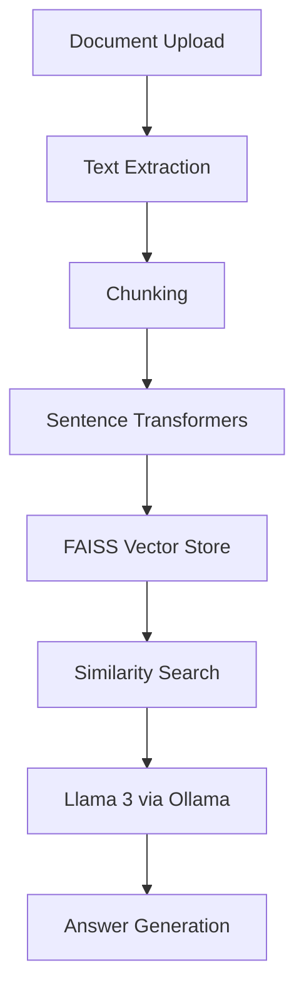
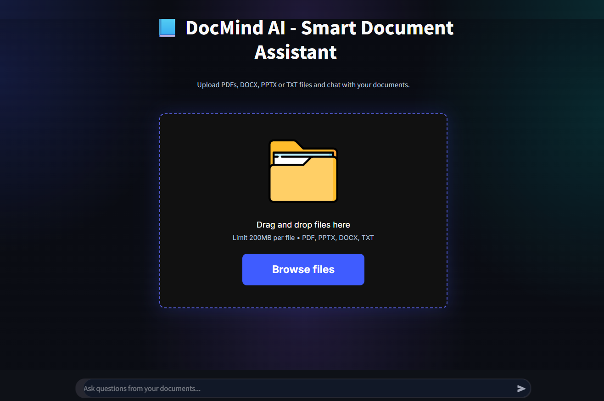
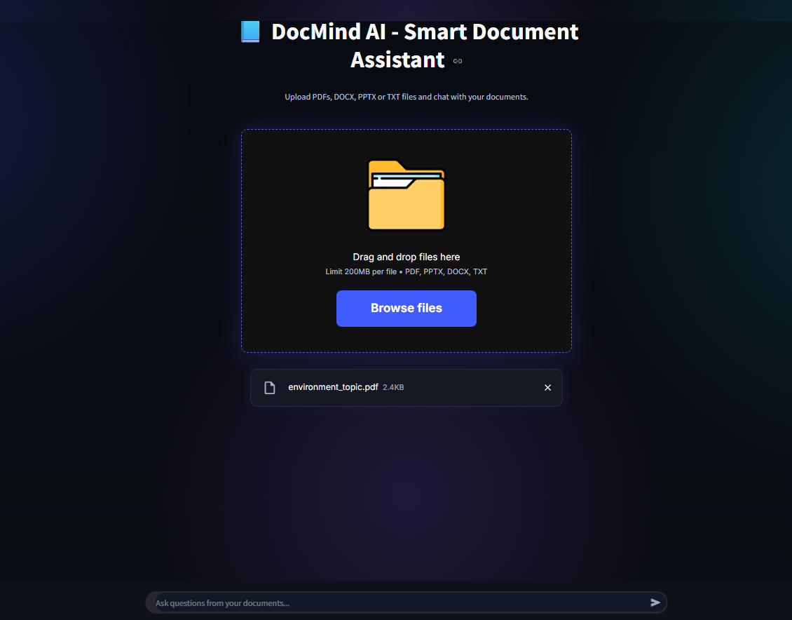
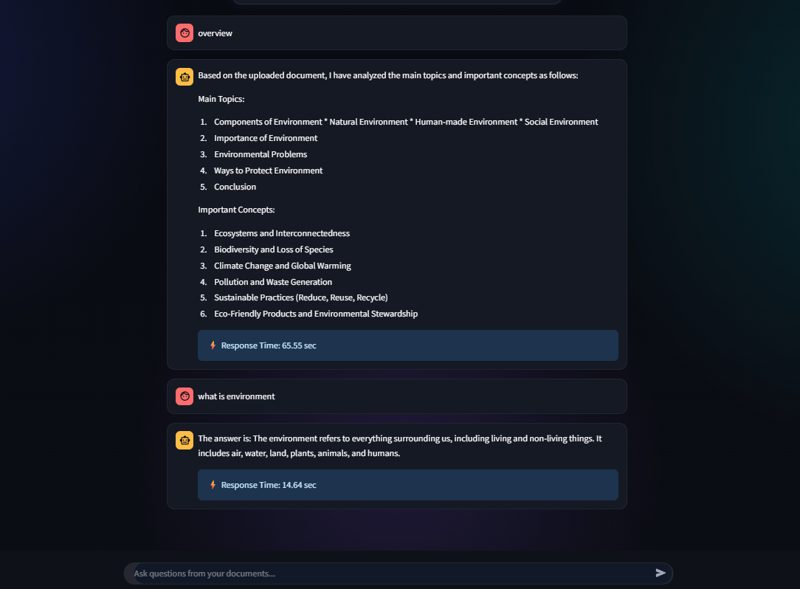

# DocMind AI

DocMind AI is an intelligent document question-answering system built using a Retrieval-Augmented Generation (RAG) pipeline. Users can upload PDF, DOCX, PPTX, or TXT files and ask natural-language questions about the document content.

## Features

* Upload and analyze PDF, DOCX, PPTX, and TXT files
* Text extraction and document processing
* Semantic search using FAISS vector database
* Sentence Transformers embeddings
* Local LLM answer generation using Ollama and Llama 3
* Context-aware question answering

## Technologies Used

* Python
* Streamlit
* FAISS
* Sentence Transformers
* Ollama
* Llama 3

## WorkFlow

## Architecture



## Project Structure

```text
docmind-ai/
├── app.py
├── src/
├── assets/screenshots/
├── requirements.txt
└── README.md
```

## Installation

pip install -r requirements.txt

## Run the Application

python -m streamlit run app.py


## Screenshots

### Home Page



### Document Upload



### Question Answering



## Limitations

- The application works best with text-based PDF, DOCX, PPTX, and TXT documents and may not perform optimally with image-based or non-text content.
- Very large documents may require more memory and longer indexing time.

## License

MIT License
