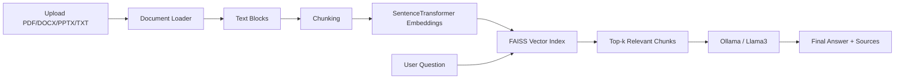

# DocMind AI

DocMind AI is an intelligent document question-answering system built with a Retrieval-Augmented Generation (RAG) pipeline. Users can upload PDF, DOCX, PPTX, or TXT files and ask natural-language questions about the document content.

> This repository keeps the original `app.py` and `src/` logic intact. The production-ready improvements are added through `streamlit_app.py`, `wrappers/`, docs, tests, and deployment files.

## Features

- Upload and analyze PDF, DOCX, PPTX, and TXT files
- Text extraction, chunking, embeddings, semantic search, and answer generation
- FAISS-based vector retrieval
- Sentence Transformers embeddings (`all-MiniLM-L6-v2`)
- Local LLM answer generation with Ollama and Llama 3
- Optimized Streamlit entrypoint with cached model loading
- FAISS index persistence for faster repeated runs
- Source chunk display for transparent answers
- Docker, CI, tests, and deployment documentation

## Architecture



## Project Structure

```text
docmind-ai/
├── app.py                  # Original Streamlit app, unchanged
├── streamlit_app.py        # Optimized resume/GitHub-ready app
├── src/                    # Original core logic, unchanged
├── wrappers/               # Non-invasive optimization and safety wrappers
├── docs/                   # Architecture, performance, deployment notes
├── tests/                  # Basic tests
├── assets/screenshots/     # Add screenshots before GitHub publishing
├── Dockerfile
├── requirements.txt
├── requirements-dev.txt
└── README.md
```

## Installation

```bash
python -m venv .venv
# Windows
.venv\Scripts\activate
# macOS/Linux
source .venv/bin/activate

pip install -r requirements.txt
```

## Ollama Setup

Install Ollama, then pull the model:

```bash
ollama pull llama3
ollama serve
```

Optional environment variables:

```bash
set DOCMIND_OLLAMA_MODEL=llama3
set OLLAMA_HOST=http://localhost:11434
```

## Run the App

Recommended optimized version:

```bash
streamlit run streamlit_app.py
```

Original version:

```bash
streamlit run app.py
```

## Performance Optimizations Added

- Streamlit resource caching for the embedding model and Ollama client
- FAISS index persistence in `artifacts/index_cache`
- Batched embedding generation
- Safe error messages when documents are missing or Ollama is unavailable
- Optional model warmup from the sidebar

These optimizations reduce repeated startup and indexing time while preserving the original retrieval logic.

## Resume Description

**DocMind AI – RAG-based Document Question Answering System**

- Built a document Q&A application using Python, Streamlit, Sentence Transformers, FAISS, and Ollama.
- Implemented document ingestion for PDF, DOCX, PPTX, and TXT files.
- Developed a RAG pipeline with chunking, vector embeddings, semantic retrieval, and local LLM answer generation.
- Added FAISS index persistence, cached embedding model loading, and source chunk display to improve performance and transparency.

## Testing

```bash
pip install -r requirements-dev.txt
pytest -q
```

## Docker

```bash
docker build -t docmind-ai .
docker run --rm -p 8501:8501 -e OLLAMA_HOST=http://host.docker.internal:11434 docmind-ai
```


## Screenshots

### Home Page


### Document Upload


### Question Answering


## Limitations

- The app needs Ollama running locally or on a reachable host.
- Scanned PDFs may need OCR; this version focuses on text-based documents.
- Very large documents may require more memory and longer indexing time.

## License

MIT License
